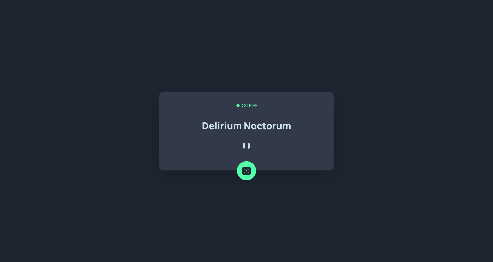

# Advice (Beer 🍺) generator app solution

## [Advice (Beer) App](https://erictakman.github.io/advice-generator-app/)

## Overview

This challenge was to build an advice generator app and get it looking as close to the design provided by Frontend Mentors example as possible. I decided to pivot and use an api that generates random beer names and breweries instead of advice because of problems with generating new advices.

### The challenge

Users should be able to:

- View the optimal layout for the app depending on their device's screen size
- See hover states for all interactive elements on the page
- Generate a new piece of advice by clicking the dice icon

## My process

Started out with adding the HTML and CSS for the basic layout. Then I added the JS to generate the advice from the api. Could not get the api to fetch new advice on click, so I pivoted and used another api that generates random beer names and breweries.

### Built with

- Semantic HTML5 markup
- CSS custom properties
- Flexbox

## Author

- Website - [Advice (Beer) App](https://erictakman.github.io/advice-generator-app/)
- Frontend Mentor - [@erictakman](https://www.frontendmentor.io/profile/erictakman)
- Twitter - [@EricTakman](https://www.twitter.com/EricTakman)

## Acknowledgments

Thanks to the Frontend Mentor for the challenge!
